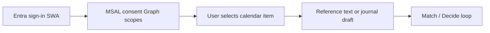

# Microsoft Graph import — design note

Status: **design only** (2026-07-11). Implementation requires explicit user approval.  
Public language: Identity / Graph / Copilot extensibility only. No career-selection wording in public docs or UI.

## Goal

Let the signed-in user **explicitly** pull a small piece of Microsoft 365 context into the Capture → Match → Decide loop. Graph is an optional input channel for Achievement journal drafts and Match reference text—not a background sync product.

## Non-goals

| Won't | Why |
|-------|-----|
| Scraping portals or mail UIs | Unsupported, brittle, policy risk |
| Always-on / silent sync | Consent and cost control; user must initiate each import |
| Broad Graph scopes on day one | Minimize consent surface and review burden |
| Shipping without approval | Entra permission grant + consent UX need a go decision |

## Recommended scopes (minimal)

Start with **delegated** permissions only:

| Scope | Role | Recommendation |
|-------|------|----------------|
| `User.Read` | Sign-in profile baseline | Always include |
| `Calendars.Read` | Meeting titles / notes → Capture draft | **Default first Graph surface** |
| `Mail.Read` | Message body → Match reference text | Alternative; add later if needed |

**Default recommendation:** `User.Read` + `Calendars.Read`. Meeting context maps cleanly to STAR Capture (situation / task) without opening mailbox content on the first consent screen.

Do not request application (daemon) permissions for this flow.

## Auth: SWA `/.auth` vs MSAL

| Mechanism | What it gives | Enough for Graph? |
|-----------|---------------|-------------------|
| SWA `/.auth` (Entra) | App session / identity for `/app/*` | No — not a Graph delegated access token for arbitrary scopes |
| **MSAL (browser)** | Delegated token with Graph scopes after consent | **Yes — required** |

Implementation will keep SWA for app gatekeeping and add MSAL (or equivalent) only for Graph token acquisition. Tokens stay client-side for user-initiated calls, or are exchanged via a narrow API that never stores refresh tokens without a separate design.

## User flow

1. User is already signed in to `/app` via SWA Entra.
2. User opens an **Import from Graph** action (not automatic).
3. MSAL requests `User.Read` + `Calendars.Read` (first time → consent UX).
4. User picks one meeting (or later: one mail).
5. App maps selected fields into:
   - Match **reference text**, and/or
   - Achievement journal **draft** (STAR fields prefilled where possible).
6. User continues the existing Match → Decide loop; nothing is written without confirm.

## Cost and approval

| Item | Expectation |
|------|-------------|
| Entra delegated permission grant | **¥0** expected (directory config only) |
| Consent UX | Must be reviewed before ship (copy, scopes, cancel path) |
| Graph API calls | Microsoft 365 tenant quotas; no new Azure billable resource for the permission itself |
| Implementation | **Blocked until user approval** of scopes + consent UX |

## Public copy

Use: Identity, Microsoft Graph, Copilot extensibility, Capture, Match, Decide, Achievement journal.  
Do not use career-selection / hiring vocabulary on GitHub, README, landing, or meta tags. Personal context stays under `/app/*`.

## Follow-ups (after approval)

1. Entra app: add delegated Graph scopes; document admin vs user consent.
2. Web: MSAL config + import picker UI.
3. Optional API helper for sanitizing imported text before Cosmos write.
4. Later: `Mail.Read` as a second import source; Copilot extensibility remains Phase 5.
