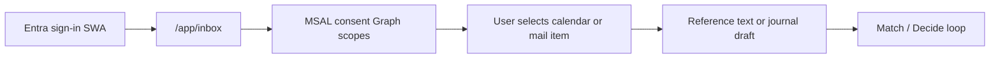

# Microsoft Graph import — design note

Status: **approved & first slice implemented** (2026-07-11).  
First slice locks **both** Outlook surfaces: Calendar + Mail.  
Public language: Identity / Graph / Copilot extensibility only. No career-selection wording in public docs or UI.

## Goal

Let the signed-in user **explicitly** pull a small piece of Microsoft 365 context into the Capture → Match → Decide loop. Graph is an optional input channel for Achievement journal drafts and Match reference text—not a background sync product.

## Non-goals

| Won't | Why |
|-------|-----|
| Scraping portals or mail UIs | Unsupported, brittle, policy risk |
| Always-on / silent sync | Consent and cost control; user must initiate each import |
| Application (daemon) permissions | Single-user delegated flow only |
| New paid Azure resources for Graph | Permission config is directory-only (¥0) |

## Locked scopes (first slice)

Delegated permissions only:

| Scope | Role | First slice |
|-------|------|-------------|
| `User.Read` | Sign-in profile baseline | Required |
| `Calendars.Read` | Meeting titles / body → journal draft or Match reference | **Yes** |
| `Mail.Read` | Message subject / body → Match reference or journal draft | **Yes** |

Do not request application (daemon) permissions for this flow.

## Auth: SWA `/.auth` vs MSAL

| Mechanism | What it gives | Enough for Graph? |
|-----------|---------------|-------------------|
| SWA `/.auth` (Entra) | App session / identity for `/app/*` | No — not a Graph delegated access token for arbitrary scopes |
| **MSAL (browser)** | Delegated token with Graph scopes after consent | **Yes — required** |

Implementation keeps SWA for app gatekeeping and adds MSAL only for Graph token acquisition. Tokens stay client-side for user-initiated Graph calls. Refresh tokens are not stored in Cosmos.

### Local / pre-consent path

When `VITE_GRAPH_USE_MOCK=true` (default when client ID is unset), the `/app/inbox` UI lists **mock** calendar and mail items so the Capture → Match loop can be exercised without Portal consent. Live Graph requires Entra delegated permissions + SPA redirect URIs — see [auth-setup.md](auth-setup.md#microsoft-graph-delegated-import).

## User flow

1. User is already signed in to `/app` via SWA Entra.
2. User opens **Inbox** (`/app/inbox`) — not automatic.
3. MSAL requests `User.Read` + `Calendars.Read` + `Mail.Read` (first time → consent UX), or mock data is used in local/dev.
4. User picks one meeting **or** one mail message (tabs).
5. App maps selected fields into:
   - Match **reference text**, and/or
   - Achievement journal **draft** (title / situation / body prefilled where possible).
6. User continues the existing Match → Decide loop; nothing is written to Cosmos without confirm.

## Cost and approval

| Item | Expectation |
|------|-------------|
| Entra delegated permission grant | **¥0** expected (directory config only) |
| Consent UX | User-initiated; cancel path on MSAL popup |
| Graph API calls | Microsoft 365 tenant quotas; no new Azure billable resource |
| Implementation | **Approved** for both Calendar + Mail (2026-07-11) |

## Public copy

Use: Identity, Microsoft Graph, Copilot extensibility, Capture, Match, Decide, Achievement journal, Inbox.  
Do not use career-selection / hiring vocabulary on GitHub, README, landing, or meta tags. Personal context stays under `/app/*`.

## Implementation map

| Piece | Location |
|-------|----------|
| Inbox UI (Calendar / Mail tabs) | `apps/web/src/pages/InboxPage.tsx` |
| MSAL config | `apps/web/src/lib/msalConfig.ts` |
| Graph client + mock | `apps/web/src/lib/graph/` |
| Prefill handoff | `location.state` → Match / Journal |
| Entra permission script | `scripts/setup-graph-permissions.ps1` |

## Follow-ups

1. Portal: grant delegated scopes + admin/user consent; add SPA redirect URIs for MSAL.
2. Optional API helper for sanitizing imported text before Cosmos write.
3. Copilot extensibility remains Phase 5.
