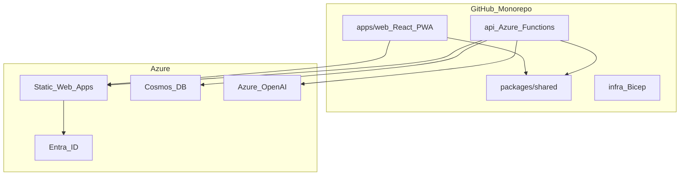

# MicroStarPlatform Monorepo — 全体像

1つの monorepo にフロント・API・共通型をまとめ、Azure Static Web Apps (SWA) へ一体デプロイする構成です。
正式名は **MicroStarPlatform**（旧称 MicroBootCan）。パッケージスコープは `@microstar/*`。

## ざっくり図



## ディレクトリの役割

| パス | 役割 |
|------|------|
| `apps/web` | UI（React + Fluent UI + Vite） |
| `api` | REST API（Azure Functions） |
| `packages/shared` | 共有型・定数・Zod スキーマ |
| `infra` | Bicep（Azure リソース定義） |

## ルーティング

| ルート | 認証 | 内容 |
|--------|------|------|
| `/` | 公開 | ポートフォリオ向けランディング |
| `/app/*` | Entra ID | 個人ワークスペース |
| `/api/*` | トークン | Functions API |

## MVP 機能とコードの対応

| 機能 | UI | API | DB コンテナ |
|------|-----|-----|-------------|
| マイルストーン・カウントダウン | ヘッダー / `/app` | — | — |
| 実績ジャーナル | `/app/journal` | `episodes` | `episodes` |
| メトリクス & サマリー | `/app/summary` | `career` | `career` |
| パイプライン管理 | `/app/pipeline` | `companies`, `applications` | 同上 |

## ローカル開発

```powershell
docker compose up -d
pnpm install
pnpm dev
```

詳細: [local-dev.md](local-dev.md)

## 公開コピー

README・ランディング・Public リポジトリ内の文章は [CHARTER.md](../CHARTER.md) の「公開コピー原則」に準拠する。
