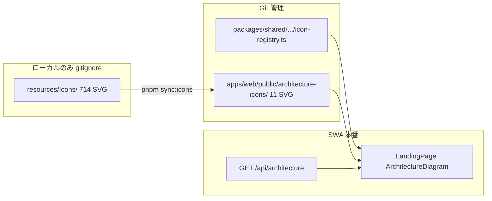

# MicroStarPlatform — Project Status

Living document: Q&A 合意・Azure リソース・進捗・次フェーズ。  
詳細計画は Cursor Plan（Q&A Plan）を参照。本ファイルは **実装と運用の現在地** を追記する。

最終更新: 2026-07-11（Track A 完了・SWA B1 出荷・Graph 設計固定）

---

## Q&A 合意サマリ

| テーマ | 合意内容 |
|--------|----------|
| **正式名** | **MicroStarPlatform**（旧称 MicroBootCan）。Azure リソース ID は `microbootcan-*` を維持 |
| **公開コピー** | 転職・選考・面接等の語は公開面に使わない。中立表現（MicroStar, DMTA, milestone, achievement journal 等）— [CHARTER.md](../CHARTER.md) |
| **月次予算** | ¥2,900 上限。Azure 操作は事前承認 + 事後「想定費用」報告 |
| **ローカル開発** | Cosmos Emulator + OpenAI モック。`APP_ENV=local` — [local-dev.md](local-dev.md) |
| **AI 戦略（暫定）** | Phase D: Gemini API（開発・低コスト）。Phase F: Azure OpenAI へ移行（ポートフォリオ完成時） |
| **構成図（Phase E）** | Mermaid は補助。**公式 Azure Architecture SVG** をランディングのメイン可視化 |
| **アイコン管理** | `resources/` は gitignore。デプロイ用サブセットを `pnpm sync:icons` で同期 |

---

## Azure リソース（`rg-microbootcan-prod`）

| リソース | 名前 / 識別子 | 状態 |
|----------|---------------|------|
| リソースグループ | `rg-microbootcan-prod` | ✅ 作成済 |
| リージョン | Japan East (`japaneast`) | — |
| 月次予算 | `MicroBootCan-Monthly` ¥2,900（80% / 100% アラート） | ✅ |
| Cosmos DB | `microbootcancosmosz6mnnh4iqiisc` | ✅ Free Tier |
| Log Analytics | `microbootcan-law-z6mnnh4iqiisc` | ✅ |
| Application Insights | `microbootcan-ai-z6mnnh4iqiisc` | ✅ |
| Azure OpenAI | `microbootcan-openai-z6mnn` | ✅ |
| Static Web Apps | `stapp-microbootcan-z6mnnh4iqiisc` | ✅ Phase A（`eastasia`） |
| Live URL | https://ambitious-desert-0763df000.7.azurestaticapps.net | 🟡 CI トークン設定後に有効 |
| Azure Functions（SWA linked） | SWA 連携 | ✅ app settings 注入済 |
| Entra App Registration | `MicroBootCan SWA` — **作成済**（Phase B） | ✅ |

### Cosmos DB コンテナ

`microbootcan` データベース: `episodes`, `companies`, `applications`, `career`, `settings`

### Azure OpenAI デプロイ

| モデル | デプロイ名 | SKU | TPM |
|--------|-----------|-----|-----|
| Chat | `gpt-5-mini` | GlobalStandard | 10K |
| Embedding | `text-embedding-3-small` | Standard | 10K |

Endpoint: `https://microbootcan-openai-z6mnn.openai.azure.com/`

---

## 現在の進捗

| 領域 | 状態 | メモ |
|------|------|------|
| Monorepo 骨格 | ✅ | `apps/web`, `api`, `packages/shared`, `infra` |
| Bicep（Cosmos + Insights + SWA モジュール） | ✅ | [azure-setup.md](azure-setup.md) |
| GitHub Actions（SWA CI/CD） | ✅ | push 済 — **`AZURE_STATIC_WEB_APPS_API_TOKEN` を GitHub Secret に登録要** |
| ランディング UI + 構成図 | ✅ | `ArchitectureDiagram` + 公式 SVG（11 ファイル同期済） |
| API（ローカルフル） | ✅ | health, architecture, episodes, pipeline, summary, settings, match |
| SWA linked API | ✅ | Phase 0 B1: Cosmos CRUD + match（`AI_PROVIDER=mock`）。`prepare-swa-api` esbuild → Oryx は `@azure/functions` + `@azure/cosmos` |
| 認証（SWA Entra） | ✅ | `/app/*` + API 保護、`useAuth` UI、`setup-entra-app.ps1` |
| 日英 i18n | ✅ | `react-i18next` + 言語切替 |
| Track A — Capture→Match→Decide | ✅ | STAR Journal・`/app/match`・Decide API/UI・Overview ライブ化（ローカル） |
| Must 4 機能 | ✅ | Journal / Pipeline / Summary / Milestone countdown（`/app` UI） |
| AI プロバイダ | ✅ | `mock` / `gemini` / `azure` + `POST /api/match`（本番 AI 切替は承認後） |
| Graph 取り込み | 📋 設計のみ | [graph-import-design.md](graph-import-design.md) — 実装は承認後 |
| 構成図 + 公式アイコン | ✅ | mock Resource Graph 応答（本番 RG 読取は承認後） |
| `resources/` gitignore + sync | ✅ | `pnpm sync:icons` → `public/architecture-icons/` |
| `pnpm build` / typecheck | ✅ | shared + api + web typecheck 成功（2026-07-11） |

### Track A（2026-07-11）

ローカル日常ループを完成。Azure 課金なし（`AI_PROVIDER=mock` 想定）。

| 項目 | 状態 |
|------|------|
| STAR Achievement journal（作成・編集・削除・空状態） | ✅ |
| Context Match UI（`/app/match` + Glossary 修正） | ✅ |
| Decide（applications/companies PATCH + nextAction / primary target UI） | ✅ |
| Overview ライブデータ（デモ依存撤去） | ✅ |

### SWA Phase 0 Step B1（出荷・2026-07-11）

本番ワークスペース API をローカル Track A と同等に拡張。

- `api/src/index.swa.ts` — health / architecture / episodes / companies / applications / summary / settings / match
- `scripts/prepare-swa-api.mjs` — esbuild で shared/zod/mock をインライン。外部は `@azure/functions` + `@azure/cosmos` のみ（Oryx install）
- 本番 app settings: `COSMOS_*` 注入済、`AI_PROVIDER=mock`（有料 AI は未承認のため切替しない）
- 実験ディレクトリ `swa-api-min/` / `swa-api-ncc-test/` / `swa-api-test/` は gitignore（コミットしない）
- 残ブロッカー: GitHub Secret `AZURE_STATIC_WEB_APPS_API_TOKEN`、Entra Portal プロバイダリンク

---

## アイコン戦略（Phase E）

Microsoft Azure Architecture Icons（**714 SVG / 28 カテゴリ**）をローカル `resources/Icons/` に保持。**Git には載せない。**

### 2 層構成



| 層 | パス | Git | 役割 |
|----|------|-----|------|
| マスター | `resources/Icons/` | **ignore** | 全 Azure アイコン。新リソース追加時のソース |
| レジストリ | `packages/shared/src/architecture/icon-registry.ts` | commit | ARM `resourceType` → アイコン ID |
| デプロイ束 | `apps/web/public/architecture-icons/` | commit | 本番/CI 用に同期された SVG のみ |
| 同期 | `scripts/sync-architecture-icons.mjs` | commit | レジストリに基づきコピー |

**開発フロー**: 新 `resourceType` → レジストリ更新 → `pnpm sync:icons` → デプロイ束をコミット。

初回 clone 後は `resources/` が無くても、コミット済みデプロイ束で構成図は動作する。

配置・同期手順: [local-dev.md](local-dev.md#azure-architecture-icons)

---

## フェーズ状況

| Phase | 内容 | コード | Azure デプロイ |
|-------|------|--------|----------------|
| **A** | SWA + GitHub Actions + Cosmos 本番接続 | ✅ Bicep + workflow | ✅ SWA デプロイ済（2026-07-11） |
| **B** | Entra 認証 + `/app` 保護 + API デプロイ | ✅ コード + Entra 登録 | 🟡 B1 コード出荷・CI トークン / Portal リンク待ち |
| **C** | Must 4 機能一括 | ✅ Cosmos repos + `/app` UI | Cosmos 既存・接続は Phase A |
| **D** | AI 抽象化 + Gemini コンテキストマッチ | ✅ `gemini-provider` + `/api/match` | ⬜ Gemini Key 設定は承認後 |
| **E** | 構成図 + 公式 SVG + Landing | ✅ mock API + UI | Resource Graph Reader は承認後 |
| **F** | Azure OpenAI 移行足場 | ✅ `azure-provider` + 手順 | 既存 OpenAI リソース利用可 |

### Phase A — 完了（2026-07-11）

1. ✅ `az deployment sub create` — SWA `stapp-microbootcan-z6mnnh4iqiisc`（**eastasia**）
2. ✅ Cosmos / App Insights 接続を SWA app settings に注入
3. ✅ `main` へ push（2 commits）
4. ⬜ GitHub Secret **`AZURE_STATIC_WEB_APPS_API_TOKEN`** を登録 → Actions 再実行
   - Azure Portal → Static Web App → **Manage deployment token**
   - リポジトリ Settings → Secrets → Actions
5. Live URL（デプロイ後）: https://ambitious-desert-0763df000.7.azurestaticapps.net

### Phase B — Entra + API（2026-07-11）

1. ✅ `staticwebapp.config.json` — `/app/*`・`/api/*` 認証、`auth.identityProviders.azureActiveDirectory`
2. ✅ `scripts/setup-entra-app.ps1` — App Registration + SWA `AZURE_CLIENT_ID` / `AZURE_CLIENT_SECRET`
3. ✅ `ALLOWED_USER_EMAIL` を SWA app settings に設定
4. ✅ `scripts/prepare-swa-api.mjs` — 軽量 API バンドル（CI `api_location: swa-api`）
5. ✅ `useAuth` + トップバー Sign in/out + 日英 i18n
6. ✅ CI #22 成功 — フロント + 認証ルート本番反映（`/app` → Entra ログインリダイレクト）
7. ⬜ Portal: Authentication → Microsoft プロバイダをリンク（client ID / secret）
8. ✅ Functions API — stock Node v4 + esbuild B1（Cosmos CRUD + mock match）
9. ✅ Phase 0 Step B1 — ワークスペース API を SWA バンドルへ出荷（デプロイは CI トークン後）

### Phase E — Resource Graph（承認後）

1. Functions Managed Identity に **Resource Graph Reader**（`rg-microbootcan-prod` スコープ）
2. `api/src/functions/architecture.ts` の mock を Resource Graph クエリに差し替え

---

## Phase F — Azure OpenAI 移行（足場）

Phase D で Gemini を主プロバイダとし、ポートフォリオ公開前に **Azure OpenAI** へ切り替える。

### 環境変数

| 変数 | 用途 |
|------|------|
| `AI_PROVIDER` | `mock` \| `gemini` \| `azure` |
| `AZURE_OPENAI_ENDPOINT` | Azure OpenAI エンドポイント |
| `AZURE_OPENAI_API_KEY` | API キー（本番は Managed Identity 検討） |
| `AZURE_OPENAI_CHAT_DEPLOYMENT` | 例: `gpt-5-mini` |
| `AZURE_OPENAI_EMBEDDING_DEPLOYMENT` | 例: `text-embedding-3-small` |

### コード配置

```
api/src/services/ai/
├── types.ts
├── mock-provider.ts
├── gemini-provider.ts
├── azure-provider.ts
├── match.ts
└── index.ts
```

### 移行手順（Phase F 実行時）

1. **前提**: Phase D のコンテキストマッチ API が `getAiProvider()` 経由で動作していること
2. **設定**: SWA / Functions App Settings に `AI_PROVIDER=azure` と OpenAI 接続情報を設定
3. **検証**: `APP_ENV=dev` で embedding + chat の結合テスト（TPM 10K 内）
4. **予算ガード**: `AI_MONTHLY_CHAT_LIMIT` / `AI_MONTHLY_EMBEDDING_LIMIT` を確認
5. **切替**: 本番 SWA で `AI_PROVIDER=azure` に変更 → デプロイ
6. **監視**: Application Insights でレイテンシ・エラー率
7. **Gemini 撤去**: `GEMINI_API_KEY` を App Settings から削除（任意）

ローカルでは引き続き `AI_PROVIDER=mock`（または未設定 + `APP_ENV=local`）で課金なし開発。

---

## Azure 承認ブロッカー（現時点）

| 操作 | 即時課金 | 月次影響 | 状態 |
|------|----------|----------|------|
| SWA 新規作成（Free） | なし | ¥0 固定想定 | **承認待ち** |
| GitHub Actions デプロイ | なし | ¥0（Actions 無料枠内想定） | トークン設定後 |
| Entra App Registration | なし | ¥0 | ✅ 完了 |
| Resource Graph Reader ロール付与 | なし | ¥0 読取のみ | **承認待ち** |
| Gemini API Key 本番設定 | 従量 | 無料枠 + 予算内要監視 | **承認待ち** |
| Azure OpenAI 本番呼び出し | 従量 | TPM 10K 内運用想定 | リソース既存・切替は承認後 |

**Phase B Entra 登録は ¥0。** App Registration + SWA app settings のみ（2026-07-11 実行）。

---

## 次回 Q&A

次回セッションで詰める候補:

### 1. Gemini API 戦略（Phase D）

| 論点 | 検討事項 |
|------|----------|
| モデル選定 | `gemini-2.0-flash` vs `gemini-1.5-pro` — コスト / レイテンシ / 日本語品質 |
| API Key 管理 | Functions App Settings vs Key Vault（v0.6 以降） |
| フォールバック | Gemini 障害時に mock 固定 vs Azure OpenAI 一時切替 |
| 予算 | Gemini 無料枠 + ¥2,900 予算との兼ね合い |

### 2. 構成図の公開粒度（Phase E）

| 論点 | 検討事項 |
|------|----------|
| リソース名 | ARM 名をそのまま表示 vs 汎用ラベル（例: `Cosmos DB`） |
| 接続情報 | エンドポイント URL は非公開。provisioning state のみ |
| 論理ノード | Entra / GitHub Actions を常時表示するか |
| 更新頻度 | ページ load 時 fetch のみ vs 定期ポーリング |

### 3. Phase A 着手 GO

| 論点 | 検討事項 |
|------|----------|
| SWA 作成 | Free tier、GitHub Actions 連携、カスタムドメイン要否 |
| Cosmos 接続 | 本番接続文字列を SWA / Functions に設定 |
| 即時課金 | SWA Free + Functions Consumption 無料枠内想定 |
| 承認 | 上記確認後、Bicep / Portal で SWA デプロイ実行 |

---

## 関連ドキュメント

| ドキュメント | 内容 |
|-------------|------|
| [CHARTER.md](../CHARTER.md) | 憲章・公開コピー・予算 |
| [local-dev.md](local-dev.md) | ローカル開発・アイコン同期 |
| [azure-setup.md](azure-setup.md) | Azure セットアップ・再デプロイ・SWA |
| [graph-import-design.md](graph-import-design.md) | Graph 委任取り込み設計（実装は承認後） |
| [monorepo-overview.md](monorepo-overview.md) | リポジトリ構成 |
| [auth-setup.md](auth-setup.md) | Entra / SWA 認証 |
